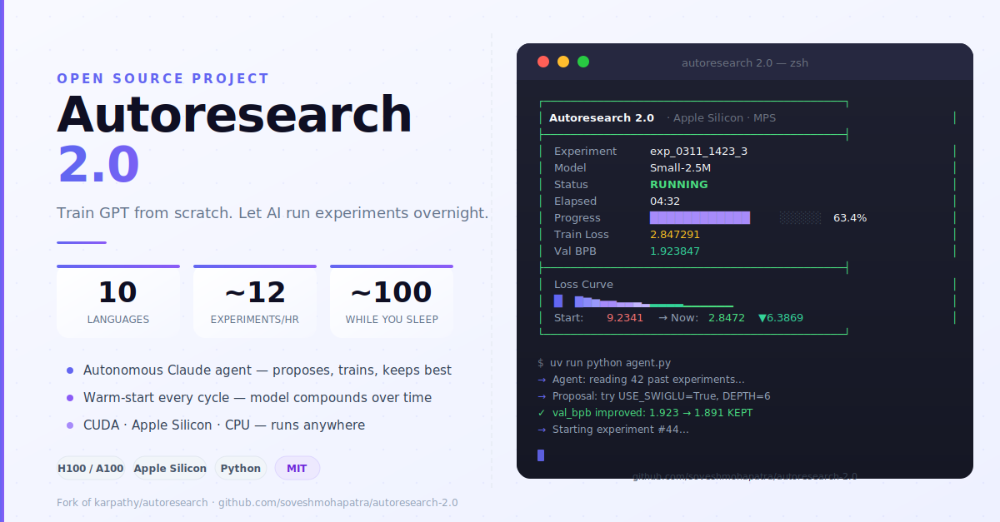

# Autoresearch 2.0



> *One day, frontier AI research used to be done by meat computers in between eating, sleeping, having other fun, and synchronizing once in a while using sound wave interconnect in the ritual of "group meeting". That era is long gone.*
> **— @karpathy, March 2026**

Train a real GPT-style language model from scratch — in your own language — and let an AI agent run experiments on it autonomously while you sleep.

---

## What it does

- Trains a GPT transformer from scratch on real Wikipedia data
- Runs autonomous experiments: tweaks architecture or optimizer, trains 5 min, keeps improvements, discards regressions
- Warm-starts every cycle from the previous best checkpoint — the model keeps getting better
- Runs Optuna-powered Bayesian hyperparameter search via `optuna_search.py`
- Keeps only the **best + latest checkpoint** per language — no disk bloat
- Works in 10 languages out of the box
- Runs anywhere: CUDA, Apple Silicon, CPU
- Single entry point — `run.py` dispatches to train, agent, optuna, or all at once

---

## Languages

| | Code | Language | | Code | Language |
|---|------|----------|-|------|----------|
| 🇺🇸 | `en` | English  | 🇯🇵 | `ja` | Japanese |
| 🇫🇷 | `fr` | French   | 🇮🇳 | `gu` | Gujarati |
| 🇪🇸 | `es` | Spanish  | 🇳🇱 | `nl` | Dutch    |
| 🇩🇪 | `de` | German   | 🇮🇳 | `or` | Odia     |
| 🇮🇳 | `hi` | Hindi    | 🇨🇳 | `zh` | Chinese  |

Data downloads automatically the first time you pick a language. No setup needed.

---

## Quick Start

```bash
# 1. Install uv (fast Python package manager)
curl -LsSf https://astral.sh/uv/install.sh | sh

# 2. Clone and install
git clone https://github.com/soveshmohapatra/autoresearch-2.0 && cd autoresearch-2.0
uv sync

# 3. Launch
uv run python gui.py
```

The dashboard handles everything from there — pick a language, pick a model, set a time budget, and go.

---

## Terminal Dashboard

```
┌─────────────────────────────────────────────┐
│  Autoresearch 2.0  ·  Apple Silicon  ·  MPS │
├─────────────────────────────────────────────┤
│  Experiment   exp_0311_1423_3               │
│  Model        Small-2.5M                   │
│  Status       RUNNING                      │
│  Elapsed      04:32                        │
│  Progress     ████████████░░░░░  63.4%     │
│  Train Loss   2.847291                     │
│  Val BPB      1.923847                     │
├─────────────────────────────────────────────┤
│  Loss Curve                                 │
│  █▇▆▅▄▄▃▃▃▂▂▂▂▂▁▁▁▁▁▁                     │
│  Start: 9.2341 → Now: 2.8472  ▼6.3869      │
└─────────────────────────────────────────────┘
```

- Live loss sparkline — see training progress at a glance
- Auto-keep loop — experiments run continuously, no prompts
- Ctrl+C to stop anytime

---

## Autonomous Agent

Let Claude propose and test architecture changes overnight:

```bash
export ANTHROPIC_API_KEY=sk-ant-...
uv run python run.py agent                   # runs forever
uv run python run.py agent --max-runs 20     # stop after 20 experiments
uv run python run.py agent --dry-run         # propose changes without training
```

The agent reads experiment history, proposes the next change, edits `train.py`, runs training, and records the result. ~12 experiments per hour. ~100 while you sleep.

---

## Manual Usage

```bash
# Prepare data for a language (automatic via GUI, but can run manually)
uv run python prepare.py --language fr

# Single training run
uv run python run.py train --language fr
uv run python run.py train --language fr --resume   # warm-start from checkpoint

# Hardware info
uv run python run_loop.py --detect

# Experiment history
uv run python gui.py --history
```

---

## Optuna Hyperparameter Search

Bayesian HPO via `optuna_search.py`, launched cleanly through `run.py`:

```bash
# Run 20 trials (default), 300s each
uv run python run.py optuna

# Custom: 50 trials, 120s budget, Hindi
uv run python run.py optuna --trials 50 --time-budget 120 --language hi

# Resume a previous study (results stored in optuna_study.db)
uv run python run.py optuna --resume

# Print the best params found so far and exit
uv run python run.py optuna --best
```

Optuna uses the **TPE sampler** (Bayesian, learns from prior trials) with **MedianPruner** to kill bad trials early. Results are persisted in `optuna_study.db` so you can resume or inspect at any time.

The search space covers:
- `DEPTH`, `ASPECT_RATIO`, `HEAD_DIM`
- `MATRIX_LR`, `WEIGHT_DECAY`
- `USE_SWIGLU`, `USE_PRENORM`, `USE_WEIGHT_TYING`
- `OPTIMIZER_TYPE`

---

## Run Everything at Once

Launch the agent and Optuna in parallel with a single command:

```bash
# Agent + Optuna together, forever
uv run python run.py all

# Custom: 20 agent runs, 30 Optuna trials, Hindi, 120s per trial
uv run python run.py all --agent-runs 20 --optuna-trials 30 --language hi --time-budget 120
```

Both processes run in the background, writing to `logs/agent.log` and `logs/optuna.log`. Output is streamed live to the terminal. Press Ctrl+C to stop both cleanly.

---

## Checkpoints

Each language keeps exactly **2 checkpoints**: the best `val_bpb` achieved so far, and the most recent. Older checkpoints are deleted automatically. Resuming a run always picks up from the best checkpoint.

Checkpoint filenames encode the metric:
```
checkpoint_step12400_bpb1.8234.pt
```

---

## AGENT EDIT ZONE

The only section of `train.py` the agent (or you) ever modifies. One change per experiment, one commit per change — the full history is always clean and reversible.

```python
# --- Model architecture ---
DEPTH         = 8           # transformer layers
ASPECT_RATIO  = 64          # model_dim = depth × aspect_ratio
HEAD_DIM      = 128         # attention head dimension
WINDOW_PATTERN = "SSSL"     # L = full context, S = half context

# --- Architecture variants ---
USE_MOE          = False    # Mixture of Experts
USE_GQA          = False    # Grouped Query Attention
USE_SWIGLU       = False    # SwiGLU activation
USE_PRENORM      = False    # Pre-norm residual stream
USE_WEIGHT_TYING = False    # Tie lm_head ↔ wte

# --- Optimizer ---
OPTIMIZER_TYPE = "muon_adamw"   # "muon_adamw" | "lion" | "adafactor"
MATRIX_LR      = 0.04
WEIGHT_DECAY   = 0.2

# --- Training ---
TIME_BUDGET       = 300     # seconds per experiment (wall clock)
TOTAL_BATCH_SIZE  = 2**19   # ~524K tokens per step
DEVICE_BATCH_SIZE = 128     # reduce if OOM
GRAD_CLIP         = 1.0
```

> **Apple Silicon:** `DEPTH ≤ 4`, `ASPECT_RATIO ≤ 32`, `DEVICE_BATCH_SIZE ≤ 4`, `MAX_SEQ_LEN ≤ 512` are auto-enforced.

---

## Platform Support

| Platform | compile | Flash Attn | Autocast | Rec. Batch |
|----------|:-------:|:----------:|:--------:|:----------:|
| CUDA H100 | ✅ | ✅ Hopper | bfloat16 | 128–256 |
| CUDA A100 | ✅ | ✅ | bfloat16 | 64–128 |
| CUDA RTX 4090 | ✅ | ✅ | bfloat16 | 32–64 |
| Apple M-Max/Ultra | ✅* | ❌ | bfloat16 | 16–32 |
| Apple M-Base | ✅* | ❌ | bfloat16 | 4 (auto-capped) |
| CPU | ❌ | ❌ | float32 | 4 |

*Requires PyTorch ≥ 2.3 and macOS ≥ 14.4

---

## Project Structure

```
autoresearch-2.0/
├── run.py              — Unified launcher (train / agent / optuna / all)
├── train.py            — Model + training loop (AGENT EDIT ZONE)
├── agent.py            — Autonomous Claude API agent
├── optuna_search.py    — Bayesian hyperparameter search (Optuna TPE)
├── gui.py              — Terminal dashboard
├── run_loop.py         — Experiment runner: git → train → record → keep/discard
├── prepare.py          — Data download, tokenizer, evaluation
├── config.py           — Hardware and experiment configuration
├── hardware.py         — Hardware detection
├── models.py           — Model catalog
└── program.md          — Agent instructions
```

---

## How the experiment loop works

```
Read history → Propose change → Edit train.py → Commit
     ↑                                              ↓
     └──── Keep / Discard ←── Measure val_bpb ←── Train
```

1. Agent reads `experiment_memory.json` — what was tried, what improved
2. Proposes one change (architecture, optimizer, hyperparameter)
3. Edits the AGENT EDIT ZONE, commits it
4. Trains for `TIME_BUDGET` seconds, warm-starting from last checkpoint
5. If `val_bpb` improved → kept. If not → `git reset --hard`
6. Repeat

---

## Design Principles

**One file, one section.** The agent only touches the AGENT EDIT ZONE. Every experiment is one commit — readable history, instant rollback.

**Fixed time budget.** Equal wall-clock time for every experiment. No cherry-picking runs. The metric is `val_bpb` (bits-per-byte) — lower is better, and it's vocab-size independent so experiments are comparable across architectures.

**Warm-start by default.** Each cycle resumes from the previous best checkpoint. The model improves run over run, not just within a run.

**Simplicity wins.** Equal val_bpb with simpler code → keep. Complexity needs to earn its place.

---

## Credits

Built on [karpathy/autoresearch](https://github.com/karpathy/autoresearch) by **Andrej Karpathy**. All credit for the original concept, architecture, and core training loop belongs to him.

**License:** MIT
