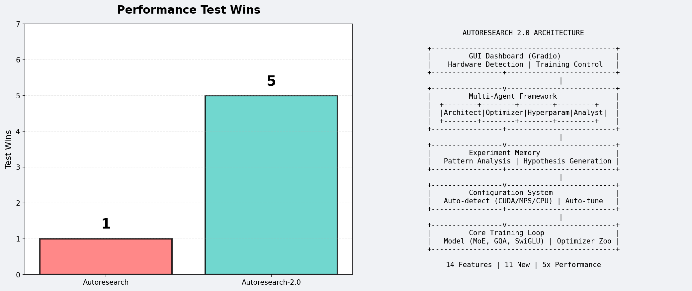

# Autoresearch 2.0



> *One day, frontier AI research used to be done by meat computers in between eating, sleeping, having other fun, and synchronizing once in a while using sound wave interconnect in the ritual of "group meeting". That era is long gone. Research is now entirely the domain of autonomous swarms of AI agents running across compute cluster megastructures in the skies. The agents claim that we are now in the 10,205th generation of the code base, in any case no one could tell if that's right or wrong as the "code" is now a self-modifying binary that has grown beyond human comprehension. This repo is the story of how it all began.*  
> **— @karpathy, March 2026**

---

## 📜 Credits & Origin

**Autoresearch 2.0** is an enhanced fork of the original [**autoresearch**](https://github.com/karpathy/autoresearch) project created by **[Andrej Karpathy](https://github.com/karpathy)**. All credit for the original concept, architecture, and implementation goes to Andrej Karpathy.

This project builds upon Andrej's foundational work with the goal of making autonomous AI research more accessible, user-friendly, and powerful.

### What Was the Original Autoresearch?

The original autoresearch was a brilliant concept: give an AI agent a small but real LLM training setup and let it experiment autonomously. It modifies the code, trains for 5 minutes, checks if the result improved, keeps or discards, and repeats. You wake up in the morning to a log of experiments and (hopefully) a better model.

The core idea is that you're not touching any of the Python files like you normally would as a researcher. Instead, you program the `program.md` Markdown files that provide context to the AI agents and set up your autonomous research org.

---

## 🚀 What's New in Autoresearch 2.0?

Autoresearch 2.0 introduces significant improvements and new features:

### 1. **Multi-Platform Support** 🖥️
- **NVIDIA GPUs (CUDA)** - Full support for RTX 3090/4090, A100, H100, etc.
- **Apple Silicon (MPS)** - Native support for M1/M2/M3 Macs
- **CPU Fallback** - Works on any system without GPU

### 2. **Automatic Hardware Detection** 🔍
- `hardware.py` automatically detects your GPU and recommends optimal configuration
- Smart auto-tuning based on available VRAM/memory
- Performance tier classification (HIGH-END vs STANDARD)

### 3. **Beautiful GUI Dashboard** 🎨
- **Gradio-based web interface** at `http://localhost:7860`
- Real-time training monitoring and control
- Hardware detection display
- Experiment history and statistics
- One-click configuration application

### 4. **Multi-Agent Framework** 🤖
A sophisticated team of specialized AI agents:
- **ArchitectureAgent** - Model architecture modifications (depth, width, attention patterns)
- **OptimizerAgent** - Optimizer selection and hyperparameter tuning
- **HyperparameterAgent** - Learning rates, batch sizes, and training dynamics
- **AnalystAgent** - Result analysis and decision making (keep/discard)

### 5. **Experiment Memory & Knowledge Base** 🧠
- Persistent storage of all experiment history
- Pattern analysis across experiments
- Hypothesis generation for next experiments
- Success rate tracking by change type

### 6. **Configuration System** ⚙️
- Dataclass-based configuration (`config.py`)
- Easy serialization and loading
- Auto-detection with manual override support
- Architecture variants support

### 7. **Architecture Variants** 🏗️
Enhanced model flexibility in `train.py`:
- **MoE (Mixture of Experts)** - Sparse expert models for high-end GPUs
- **GQA (Grouped Query Attention)** - Memory-efficient attention
- **SwiGLU / GeGLU** - Advanced activation functions
- **Pre-norm architecture** - Alternative normalization strategy

### 8. **Optimizer Zoo** 🎯
Multiple optimizer options:
- **Muon + AdamW** - Default, best for most cases
- **Lion** - Memory efficient
- **Adafactor** - Adaptive learning rates

### 9. **Experiment Tracking** 📊
- **Weights & Biases integration** - Optional experiment logging
- **Checkpointing** - Automatic model saving
- **Metrics tracking** - Comprehensive experiment statistics

### 10. **Testing Framework** ✅
- Pytest-based test suite
- Tests for configuration and agent systems
- CI/CD ready

### 11. **Quick Start Scripts** ⚡
- `setup.sh` - One-command setup
- `start.sh` - Launch GUI dashboard
- `hardware.py` --detect-only - Quick hardware detection

---

## 🏃 Quick Start (3 Steps!)

### 1. Install & Setup

```bash
# Clone and enter the repo
git clone https://github.com/soveshmohapatra/autoresearch-2.git
cd autoresearch-2

# Run the setup script (installs uv + dependencies)
./setup.sh
```

### 2. Detect Your Hardware

```bash
# Auto-detects GPU and recommends optimal config
uv run python hardware.py
```

**Automatically detects and optimizes for:**
- 🟢 **NVIDIA GPUs** (CUDA) - RTX 3090/4090, A100, H100, etc.
- 🍎 **Apple Silicon** (MPS) - M1/M2/M3, all variants
- 💻 **CPU** - Fallback for any system

### 3. Launch the GUI

```bash
# Beautiful web dashboard for monitoring & control
./start.sh
```

The dashboard opens at **http://localhost:7860** with:
- 🔍 Hardware detection & auto-configuration
- 🎮 Training control (start/stop/monitor)
- 📊 Experiment history & statistics
- ⚙️ Settings for architecture variants

---

## 📦 Manual Quick Start

```bash
# 1. Install uv (if you don't have it)
curl -LsSf https://astral.sh/uv/install.sh | sh

# 2. Install dependencies
uv sync

# 3. Download data and train tokenizer (~2 min)
uv run python prepare.py

# 4. Train a model (~5 min)
uv run python train.py
```

That's it! The system auto-configures for your hardware.

---

## 🤖 Running the Agent

Simply spin up your Claude/Codex or whatever you want in this repo (and disable all permissions), then you can prompt something like:

```
Hi have a look at program.md and let's kick off a new experiment! Let's do the setup first.
```

The `program.md` file is essentially a super lightweight "skill".

With the multi-agent framework in 2.0, you can now also invoke specialized agents:

```python
from agents import ArchitectureAgent, OptimizerAgent, HyperparameterAgent, AnalystAgent

# Each agent specializes in different aspects of experimentation
architecture_agent = ArchitectureAgent()
optimizer_agent = OptimizerAgent()
# ... etc
```

---

## 📁 Project Structure

```
autoresearch-2.0/
├── prepare.py          # Constants, data prep + runtime utilities (do not modify)
├── train.py            # Model, optimizer, training loop (agent modifies this)
├── program.md          # Agent instructions
├── config.py           # Configuration system (NEW in 2.0)
├── hardware.py         # Hardware detection (NEW in 2.0)
├── gui.py              # GUI dashboard (NEW in 2.0)
├── setup.sh            # Setup script (NEW in 2.0)
├── start.sh            # Quick start script (NEW in 2.0)
├── agents/             # Multi-agent framework (NEW in 2.0)
│   ├── __init__.py
│   ├── memory.py       # Experiment memory
│   ├── architecture.py # Architecture agent
│   ├── optimizer.py    # Optimizer agent
│   ├── hyperparameter.py
│   ├── analyst.py      # Analyst agent
│   └── utils.py
├── tests/              # Test suite (NEW in 2.0)
│   ├── test_config.py
│   └── test_agents.py
└── pyproject.toml      # Dependencies
```

---

## 🎯 Design Choices

- **Single file to modify.** The agent only touches `train.py`. This keeps the scope manageable and diffs reviewable.
- **Fixed time budget.** Training always runs for exactly 5 minutes, regardless of your specific platform. This means you can expect approx 12 experiments/hour and approx 100 experiments while you sleep.
- **Self-contained.** No external dependencies beyond PyTorch and a few small packages. No distributed training, no complex configs. One GPU, one file, one metric.
- **Multi-platform.** Unlike the original, 2.0 supports CUDA, MPS, and CPU out of the box.
- **Agent memory.** Experiments are stored persistently, enabling learning from past results.

---

## 🖥️ Platform Support

Autoresearch 2.0 supports multiple platforms:

| Platform | Device | Precision | Max Recommended Depth |
|----------|--------|-----------|----------------------|
| **NVIDIA H100/A100** | CUDA | bfloat16 | 12+ layers |
| **RTX 4090/3090** | CUDA | bfloat16/float16 | 8-10 layers |
| **RTX 4080/3080** | CUDA | float16 | 6-8 layers |
| **M3/M2/M1 Max/Ultra** | MPS | float32 | 8 layers |
| **M3/M2/M1 Pro** | MPS | float32 | 6 layers |
| **M3/M2/M1 (base)** | MPS | float32 | 4 layers |
| **CPU** | CPU | float32 | 4 layers |

The system auto-detects your hardware and applies optimal configuration.

---

## 📊 Configuration Recommendations for Smaller Hardware

If you're running on smaller computers (MacBooks, consumer GPUs), here are recommendations:

1. **Use a simpler dataset** - Try [TinyStories](https://huggingface.co/datasets/karpathy/tinystories-gpt4-clean) for narrower scope
2. **Decrease vocab_size** - From 8192 down to 4096, 2048, or even 256 (byte-level)
3. **Lower MAX_SEQ_LEN** - In `prepare.py`, reduce to 256-512 depending on your hardware
4. **Reduce DEPTH** - In `train.py`, lower from 8 to 4-6 layers
5. **Use simpler window pattern** - Try "L" instead of "SSSL"
6. **Lower TOTAL_BATCH_SIZE** - Keep powers of 2, e.g., 2^14 (~16K)

The hardware detection system (`hardware.py`) automatically applies these optimizations for you!

---

## 🔗 Repository

**Source Code:** [github.com/soveshmohapatra/autoresearch-2](https://github.com/soveshmohapatra/autoresearch-2.git)

---

## 🙏 Acknowledgments

- **Original Concept & Implementation:** [Andrej Karpathy](https://github.com/karpathy)
- **Base Repository:** [karpathy/autoresearch](https://github.com/karpathy/autoresearch)
- **Parent Project:** [karpathy/nanochat](https://github.com/karpathy/nanochat)

Autoresearch 2.0 stands on the shoulders of giants. Thank you, Andrej, for inspiring this work!

---

## 📄 License

MIT
